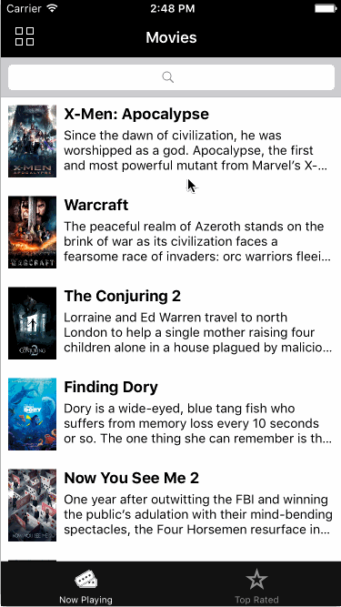

# Project 1 - Flicks

Flicks is a movies app using the [The Movie Database API](http://docs.themoviedb.apiary.io/#).

## User Stories

The following **required** functionality is completed:

- [x] User can view a list of movies currently playing in theaters. Poster images load asynchronously.
- [x] User can view movie details by tapping on a cell.
- [x] User sees loading state while waiting for the API.
- [x] User sees an error message when there is a network error.
- [x] User can pull to refresh the movie list.

The following **optional** features are implemented:

- [x] Add a tab bar for **Now Playing** and **Top Rated** movies.
- [x] Implement bar button item to switch between list view and grid view.
- [x] Add a search bar.
- [x] All images fade in.
- [x] For the large poster, load the low-res image first, switch to high-res when complete.
- [x] Customize the highlight and selection effect of the cell.
- [x] Customize the navigation bar.

The following **additional** features are implemented:

- [x] Long movie titles wrap in the detail view.
- [x] Used NSDateFormatter to convert and format dates.
- [x] Created a custom view for the network error view.
- [x] Collection view cell size changes accoring to the device screen size to always have only two cells per row.
- [x] On the movie detail screen the movie detail view animates to inform the user that there is more content.

## Video Walk-through

Here's a walk-through of implemented user stories:

Video showing the network error:

I made the video with the following settings:

- I set configuration.URLCache = nil to keep NSURLSession from caching the request. Otherwise it was difficult to show the network error message.
- I used the Network Link Conditioner to reduce the bandwidth (DSL profile) so you could see the images loading and to simulate 100% data loss.

GIF created with [LiceCap](http://www.cockos.com/licecap/).

## Icons

- The tickets icon on the tab bar was created by Arthur Lacôte of the Noun Project [thenounproject](http://thenounproject.com).
- Some of the icons came from [iconmonstr](http://iconmonstr.com)
- Some of the icons (including the app icon) were made by me, Marc Adam Anderson.

## License

    Copyright 2016 Marc Adam Anderson

    Licensed under the Apache License, Version 2.0 (the "License");
    you may not use this file except in compliance with the License.
    You may obtain a copy of the License at

        http://www.apache.org/licenses/LICENSE-2.0

    Unless required by applicable law or agreed to in writing, software
    distributed under the License is distributed on an "AS IS" BASIS,
    WITHOUT WARRANTIES OR CONDITIONS OF ANY KIND, either express or implied.
    See the License for the specific language governing permissions and
    limitations under the License.
